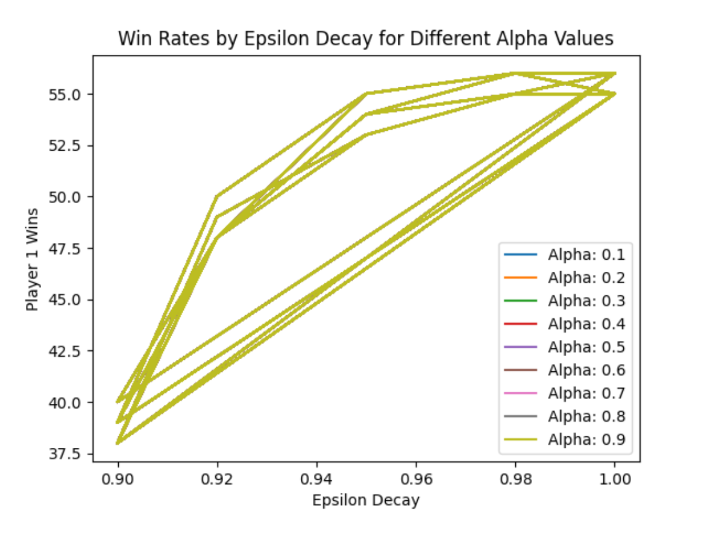

# Yut-AI

## Algorithm Description:
Our ETyut algorithm employs a Q-learning decision-making strategy to evaluate potential moves in the game of YutNori game (Korean traditional baord game). The primary focus of our algorithm is to maximize the expected cumulative reward for each move by updating a Q-table based on observed outcomes. It balances exploration and exploitation to assess and select optimal actions. Key enhancements include optimizing hyperparameters like epsilon, gamma, and alpha decay values to achieve the best performance, as well as maintaining a Q-table to store Q-values for various state-action pairs.

## Key Components:
**1. Initialization and Reset:** The reset method initializes the algorithm for each game round, resetting internal states and allowing for an optional random seed for variability in simulations. It also randomizes the Q-table to enhance variability.  
**2. Action Selection:** The action method evaluates all legal moves for the current turn. It balances exploration and exploitation through an epsilon-greedy strategy, selecting either a random move or the move with the highest Q-value based on the current state.  
**3. Q-Table Management:** A Q-table is used to maintain Q-values, which are updated based on rewards received from actions. A penalty of -10 is applied for illegal moves, while a reward of 10 is given for catching a mal. The Q-values are updated using the Q-value formula.  
**4. Epsilon Adjustment:** The algorithm adjusts the exploration rate (epsilon) based on performance. If the reward is greater than zero, epsilon decays, promoting exploration. Conversely, if the reward is zero or negative, epsilon is increased to encourage more exploration.  
**5. Multiplier Optimization:** Multipliers are used to adjust the influence of different game states on the scoring system, enhancing the algorithm's decision-making. These values were optimized to reflect the relative importance of each position using a trial-and-error method.  
**6. Mechanism:** When no clear optimal decision is apparent, the algorithm employs a fallback mechanism to select legal moves randomly, ensuring gameplay continuity.

### Optimal Performance Results: 
The algorithm was tested in 100 games against the opponent, with ETyut achieving 56 wins.

**Conclusion:** Our algorithm demonstrates the effectiveness of Q-learning for decision-making using reinforcement learning in a probabilistic game environment. We attempted to train our algorithm using pre-recorded game outputs by logging them into a JSON file but faced challenges due to our inexperience with JSON. The tuning of parameters, including epsilon, gamma, and alpha decay values, allows for optimal win rates. The use of a Q-table to maintain Q-values, along with a reward system that incentivizes capturing mals and penalizes illegal moves, contributes to competitive performance
against the competitors.

***

## About YurNori Game:
* See https://en.wikipedia.org/wiki/Yut for the basic rules of yut.
* There are six possible yut score values: 1 ('do', 11.52%), 2 ('gae', 34.56%), 3 ('geol', 34.56%), 4 ('yut', 12.96%), 5 ('mo', 2.56%), and -1 ('backdo', 3.84%).
* Initially all mals are located at position 0. You the game when all your mals arrive position 30.
* When moving a mal at position 5, 10, or 15, you have to move through the shortcut (to position 13, 11, or 23, respectively).
* If you have used 'yut' or 'mo' to catch the opponent's mal, you do NOT gain a chance to cast yuts one more time.
* Once two or more mals get located at the same position, these mals have to move together until all they die or finish the run.
* If you try to move a mal at position 30, it is considered as an illegal move and you lose immediately.
